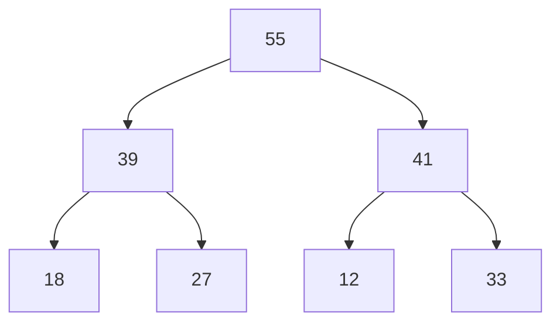
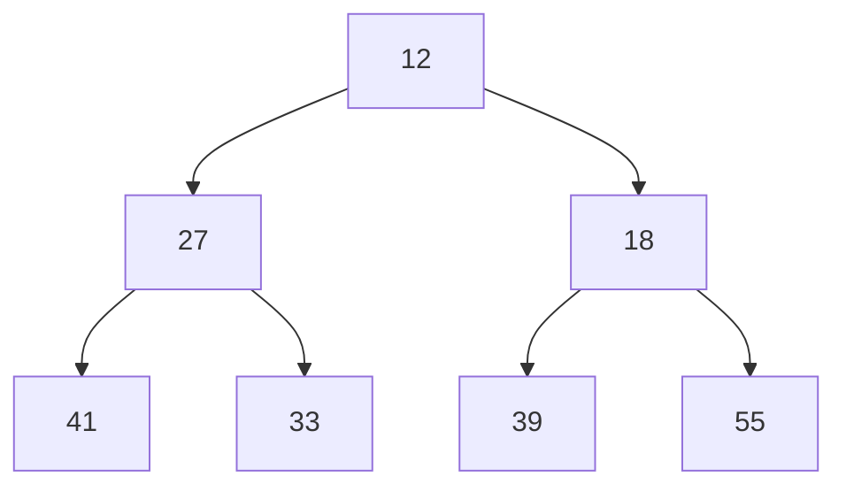

# Binary Heaps

A **Binary Heap** is a heap data structure that takes the form of a binary tree. Binary heaps are a common way of implementing priority queues. The binary heap was introduced by J. W. J. Williams in 1964, as a data structure for _Heapsort_.


A Binary Heap is defined as a Binary Tree with two additional constraints:

- Shape property: a Binary Heap is a complete Binary Tree; that is, all levels of the tree, except possibly the last one (deepest) are fully filled, and, if the last level of the tree is not complete, the nodes of that level are filled from left to right.
- Heap property: the value stored in each node is either greater than or equal to (max-heap) or less than or equal to (min-heap) the values in the node's children, according to some total order.

Efficient (logarithmic time) algorithms are known for the two operations needed to implement a priority queue on a binary heap: inserting an element, and removing the smallest or largest element from a min-heap or max-heap, respectively. Binary heaps are also commonly employed in the heapsort sorting algorithm, which is an in-place algorithm because binary heaps can be implemented as an implicit data structure, storing keys in an array and using their relative positions within that array to represent child-parent relationships.

## Implementing a Binary Heap

### Creating the `MaxBinaryHeap` class

A Binary Heap's values can be represented via an array. Some mathematical operations can then be performed on any given node's index to get its parent or children nodes.


Example:

- `const maxHeap = new MaxBinaryHeap();`

```js
class MaxBinaryHeap {
  constructor() {
    this.values = [];
  }
}
```

### Insert

To add an element to a heap, we can perform this algorithm:

1. Add the element to the bottom level of the heap at the leftmost open space.
2. Compare the added element with its parent; if they are in the correct order, stop.
3. If not, swap the element with its parent and return to the previous step.

> **NOTE:** For a given node with index **_i_**:
>
> - Its left child will have an index of **_2i + 1_**,
> - Its right child will have an index of **_2i + 2_**, and
> - Its parent will have an index of **_Math.floor((i - 1) / 2)_**.

**Example**:



- ```js
  maxHeap
    .insert(41)
    .insert(39)
    .insert(33)
    .insert(18)
    .insert(27)
    .insert(12)
    .insert(55);
  // should return heap with values [55, 39, 41, 18, 27, 12, 33]
  ```

```js
//* The insert method accepts a value to be added
//* to the heap
insert(value) {
  //  Add value to end of the values list
  this.values.push(value);

  //  Bubble up the value to its correct spot:
  const bubbleUp = (current, parent) => {
    //  If parent index is less than the root, exit the function
    if (parent < 0) return;
    //  If value is greater than the parent:
    if (this.values[current] > this.values[parent]) {
      //  Swap the value and its parent
      [this.values[current], this.values[parent]] = [
        this.values[parent],
        this.values[current],
      ];
      //  Set new current index to be the parent index,
      //  then start over
      bubbleUp(parent, Math.floor((parent - 1) / 2));
    }
  };

  //  Start bubbling up
  const currentIdx = this.values.length - 1;
  bubbleUp(currentIdx, Math.floor((currentIdx - 1) / 2));

  //  Optionally, return the heap to chain other method calls
  return this;
}
```

### Extract

The procedure for extracting, or deleting the root from the heap (effectively extracting the maximum element in a max-heap or the minimum element in a min-heap) while retaining the heap property is as follows:

1. Replace the root of the heap with the last element on the last level.
2. Compare the new root with its children; if they are in the correct order, stop.
3. If not, swap the element with one of its children and return to the previous step. (Swap with its smaller child in a min-heap and its larger child in a max-heap.)

**Example:**

- `maxHeap.extractMax() // should return 55`

```js
//* The extractMax method removes the root node
//* from the heap, and returns its value.
extractMax() {
  //  Swap the root with the most recently added node
  [this.values[0], this.values[this.values.length - 1]] = [
    this.values[this.values.length - 1],
    this.values[0],
  ];

  //  Get the value of the previous root node
  const value = this.values.pop();

  //  Bubble down the new root to its correct spot:
  const bubbleDown = (parent) => {
    //  Get the two children nodes
    const child1Idx = 2 * parent + 1;
    const child1 = this.values[child1Idx] || -Infinity;
    const child2Idx = 2 * parent + 2;
    const child2 = this.values[child2Idx] || -Infinity;
    //  If child indices are out of bounds, exit the function
    if (child1Idx >= this.values.length) {
      return;
    }
    //  If parent is greater than both children, exit the function
    if (this.values[parent] >= child1 && this.values[parent] >= child2) {
      return;
    }
    let swap = -1;
    //  If both children are greater than the parent:
    if (this.values[parent] < child1 && this.values[parent] < child2) {
      //  Swap parent with the larger child
      if (child1 > child2) {
        swap = child1Idx;
      } else {
        swap = child2Idx;
      }
    }
    //  If only one child is greater than the parent:
    //  Swap parent with that child
    else if (this.values[parent] < child1) {
      swap = child1Idx;
    } else {
      swap = child2Idx;
    }
    //  Set new parent index to be the larger child's index
    [this.values[parent], this.values[swap]] = [
      this.values[swap],
      this.values[parent],
    ];
    bubbleDown(swap);
  };

  //  Start bubbling down
  bubbleDown(0);

  //  Return the value of the root node
  return value;
}
```

### Alternative Version for Min-Heaps



- `const minHeap = new MinBinaryHeap();`
- ```js
  minHeap
    .insert(41)
    .insert(39)
    .insert(33)
    .insert(18)
    .insert(27)
    .insert(12)
    .insert(55);
  // should return heap with values [12, 27, 18, 41, 33, 39, 55]
  ```
- `minHeap.extractMin() // should return 12`

```js
class MinBinaryHeap {
  constructor() {
    this.values = [];
  }

  //* The insert method accepts a value to be added
  //* to the heap
  insert(value) {
    //  Add value to end of the values list
    this.values.push(value);

    //  Bubble up the value to its correct spot:
    const bubbleUp = (current, parent) => {
      //  If parent index is less than the root, exit the function
      if (parent < 0) return;
      //  If value is greater than the parent:
      if (this.values[current] < this.values[parent]) {
        //  Swap the value and its parent
        [this.values[current], this.values[parent]] = [
          this.values[parent],
          this.values[current],
        ];
        //  Set new current index to be the parent index,
        //  then start over
        bubbleUp(parent, Math.floor((parent - 1) / 2));
      }
    };

    //  Start bubbling up
    const currentIdx = this.values.length - 1;
    bubbleUp(currentIdx, Math.floor((currentIdx - 1) / 2));

    //  Optionally, return the heap to chain other method calls
    return this;
  }

  //* The extractMin method removes the root node
  //* from the heap, and returns its value.
  extractMin() {
    //  Swap the root with the most recently added node
    [this.values[0], this.values[this.values.length - 1]] = [
      this.values[this.values.length - 1],
      this.values[0],
    ];

    //  Get the value of the previous root node
    const value = this.values.pop();

    //  Bubble down the new root to its correct spot:
    const bubbleDown = (parent) => {
      //  Get the two children nodes
      const child1Idx = 2 * parent + 1;
      const child1 = this.values[child1Idx] || Infinity;
      const child2Idx = 2 * parent + 2;
      const child2 = this.values[child2Idx] || Infinity;
      //  If child indices are out of bounds, exit the function
      if (child1Idx >= this.values.length) {
        return;
      }
      //  If parent is less than both children, exit the function
      if (this.values[parent] <= child1 && this.values[parent] <= child2) {
        return;
      }
      let swap = -1;
      //  If both children are greater than the parent:
      if (this.values[parent] > child1 && this.values[parent] > child2) {
        //  Swap parent with the smaller child
        if (child1 < child2) {
          swap = child1Idx;
        } else {
          swap = child2Idx;
        }
      }
      //  If only one child is less than the parent:
      //  Swap parent with that child
      else if (this.values[parent] > child1) {
        swap = child1Idx;
      } else {
        swap = child2Idx;
      }
      //  Set new parent index to be the smaller child's index
      [this.values[parent], this.values[swap]] = [
        this.values[swap],
        this.values[parent],
      ];
      bubbleDown(swap);
    };

    //  Start bubbling down
    bubbleDown(0);

    //  Return the value of the root node
    return value;
  }
}
```

---

## References

[Wikipedia - Binary heap](https://en.wikipedia.org/wiki/Binary_heap)
