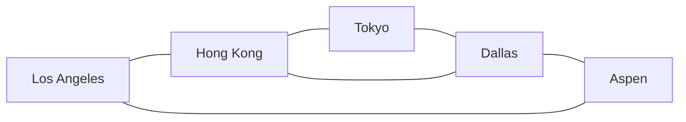
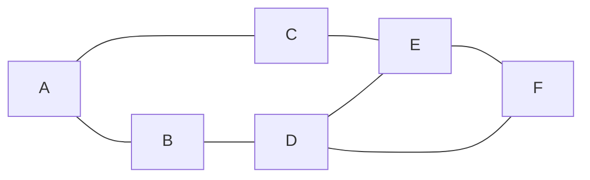

# Graphs

A **Graph** is an abstract data type that is meant to implement the undirected graph and directed graph concepts from the field of graph theory within mathematics.

A graph data structure consists of a finite (and possibly mutable) set of vertices (also called nodes or points), together with a set of unordered pairs of these vertices for an undirected graph or a set of ordered pairs for a directed graph. These pairs are known as edges (also called links or lines), and for a directed graph are also known as edges but also sometimes arrows or arcs. The vertices may be part of the graph structure, or may be external entities represented by integer indices or references.


A graph data structure may also associate to each edge some edge value, such as a symbolic label or a numeric attribute (cost, capacity, length, etc.).

Graphs are used to solve many real-life problems. Graphs are used to represent networks. The networks may include paths in a city or telephone network or circuit network. Graphs are also used in social networks where each person is represented with a vertex(or node). Each node is a structure and contains information like person id, name, gender, locale etc.

## Operations

### Representing a Graph

A graph can be represented in three ways:

- **Adjacency List** - Vertices are stored as records or objects, and every vertex stores a list of adjacent vertices. This data structure allows the storage of additional data on the vertices. Additional data can be stored if edges are also stored as objects, in which case each vertex stores its incident edges and each edge stores its incident vertices.
- **Adjacency Matrix** - A two-dimensional matrix, in which the rows represent source vertices and columns represent destination vertices. Data on edges and vertices must be stored externally. Only the cost for one edge can be stored between each pair of vertices.
- **Incidence Matrix** - A two-dimensional matrix, in which the rows represent the vertices and columns represent the edges. The entries indicate the incidence relation between the vertex at a row and edge at a column.

The following table gives the time complexity cost of performing various operations on graphs, for each of these representations, with **_V_** the number of vertices and **_E_** the number of edges. In the matrix representations, the entries encode the cost of following an edge. The cost of edges that are not present are assumed to be ∞.

|                                                                                      | Adjacency list                                                                    | Adjacency matrix                                                      | Incidence matrix                                                                |
| ------------------------------------------------------------------------------------ | --------------------------------------------------------------------------------- | --------------------------------------------------------------------- | ------------------------------------------------------------------------------- |
| **Store graph**                                                                      | **O(V + E)**                                                                      | **O(V<sup>2</sup>)**                                                  | **O(V ⋅ E)**                                                                    |
| **Add vertex**                                                                       | **O(1)**                                                                          | **O(V<sup>2</sup>)**                                                  | **O(V ⋅ E)**                                                                    |
| **Add edge**                                                                         | **O(1)**                                                                          | **O(1)**                                                              | **O(V ⋅ E)**                                                                    |
| **Remove vertex**                                                                    | **O(E)**                                                                          | **O(V<sup>2</sup>)**                                                  | **O(V ⋅ E)**                                                                    |
| **Remove edge**                                                                      | **O(V)**                                                                          | **O(1)**                                                              | **O(V ⋅ E)**                                                                    |
| **Are vertices x and y adjacent (assuming that their storage positions are known)?** | **O(V)**                                                                          | **O(1)**                                                              | **O(E)**                                                                        |
| **Remarks**                                                                          | Slow to remove vertices and edges, because it needs to find all vertices or edges | Slow to add or remove vertices, because matrix must be resized/copied | Slow to add or remove vertices and edges, because matrix must be resized/copied |

For this section, we shall be creating _undirected_ graphs, and use Adjacency lists to store the graph data. Adjacency lists are generally preferred because they efficiently represent sparse graphs, or graphs where there are much less edges than the number of vertices squared.

**Example:**

- `const graph = new Graph();`

```js
class Graph {
  constructor() {
    this.adjacencyList = {};
  }
}
```

### Add Vertex

**Example:**

- ```js
  graph
    .addVertex("Tokyo")
    .addVertex("Dallas")
    .addVertex("Aspen")
    .addVertex("Los Angeles")
    .addVertex("Hong Kong");
  ```

```js
addVertex(vertex) {
  //  If vertex is not currently in adjacency list:
  if (!this.adjacencyList[vertex]) {
    //  Initialize the new vertex with an empty array
    this.adjacencyList[vertex] = [];
  }

  //  Optionally return the graph for easy chaining
  return this;
}
```

### Add Edge

Adding an edge to an undirected graph is essentially the same operation as adding a directed edge from one vertex to another, and vice versa. This means we can use an `addDirectedEdge()` operation as a helper function to add an undirected edge:

```js
addDirectedEdge(vertex1, vertex2) {
  //  If vertices are not already connected,
  //  simply push one vertex to the other's adjacency list
  if (!this.adjacencyList[vertex1].includes(vertex2)) {
    this.adjacencyList[vertex1].push(vertex2);
  }

  //  Optionally return the graph for easy chaining
  return this;
}
```

**Example:**



- ```js
  graph
    .addEdge("Tokyo", "Dallas")
    .addEdge("Dallas", "Aspen")
    .addEdge("Hong Kong", "Tokyo")
    .addEdge("Hong Kong", "Dallas")
    .addEdge("Los Angeles", "Hong Kong")
    .addEdge("Los Angeles", "Aspen");
  ```

```js
addEdge(vertex1, vertex2) {
  //  For undirected graphs,
  //  simply add directed edge going both ways
  this.addDirectedEdge(vertex1, vertex2).addDirectedEdge(vertex2, vertex1);

  //  Optionally return the graph for easy chaining
  return this;
}
```

### Remove Edge

Removing an edge from an undirected graph can also be the same operation as removing directed edges going both ways from two vertices. This means we can use a `removeDirectedEdge()` operation as a helper function to remove an undirected edge:

```js
removeDirectedEdge(vertex1, vertex2) {
  //  Simply filter out vertex2 from vertex1's adjacency list
  this.adjacencyList[vertex1] = this.adjacencyList[vertex1].filter(
    (v) => v !== vertex2
  );

  //  Optionally return the graph for easy chaining
  return this;
}
```

**Example:**

- `graph.removeEdge("Tokyo", "Dallas");`

```js
removeEdge(vertex1, vertex2) {
  //  For undirected graphs,
  //  simply remove directed edges going both ways
  this.removeDirectedEdge(vertex1, vertex2).removeDirectedEdge(
    vertex2,
    vertex1
  );

  //  Optionally return the graph for easy chaining
  return this;
}
```

### Remove Vertex

**Example:**

- `graph.removeVertex("Dallas")`

```js
removeVertex(vertex) {
  //  Remove all edges connected to the vertex
  for (let adjacentVertex of this.adjacencyList[vertex]) {
    this.removeDirectedEdge(adjacentVertex, vertex);
  }

  //  Remove the vertex itself
  delete this.adjacencyList[vertex];

  //  Optionally return the graph for easy chaining
  return this;
}
```

### Weighted Graphs

Implementing a weighted graph is quite similar to unweighted graphs, except for the items in the adjacency list now having to store weight values alongside the vertices.

**Example:**

- `const g = new WeightedGraph();`
- ```js
  g.addVertex("A")
    .addVertex("B")
    .addVertex("C")
    .addVertex("D")
    .addVertex("E")
    .addVertex("F");
  ```
- ```js
  g.addEdge("A", "B", 4)
    .addEdge("A", "C", 2)
    .addEdge("B", "E", 3)
    .addEdge("C", "D", 2)
    .addEdge("C", "F", 4)
    .addEdge("D", "E", 3)
    .addEdge("D", "F", 1)
    .addEdge("E", "F", 1);
  ```

```js
class WeightedGraph {
  constructor() {
    this.adjacencyList = {};
  }

  addVertex(vertex) {
    //  If vertex is not currently in adjacency list:
    if (!this.adjacencyList[vertex]) {
      //  Initialize the new vertex with an empty array
      this.adjacencyList[vertex] = [];
    }

    //  Optionally return the graph for easy chaining
    return this;
  }

  addEdge(vertex1, vertex2, weight) {
    //  For undirected graphs,
    //  simply add directed edge going both ways
    this.addDirectedEdge(vertex1, vertex2, weight).addDirectedEdge(
      vertex2,
      vertex1,
      weight
    );

    //  Optionally return the graph for easy chaining
    return this;
  }

  addDirectedEdge(vertex1, vertex2, weight) {
    //  If vertices are not already connected,
    //  simply push one vertex to the other's adjacency list
    const isConnected = this.adjacencyList[vertex1].filter(
      (item) => item.vertex === vertex2
    ).length;
    if (!isConnected) {
      this.adjacencyList[vertex1].push({ vertex: vertex2, weight });
    }

    //  Optionally return the graph for easy chaining
    return this;
  }

  removeVertex(vertex) {
    //  Remove all edges connected to the vertex
    for (let adjacentVertex of this.adjacencyList[vertex]) {
      this.removeDirectedEdge(adjacentVertex.vertex, vertex);
    }

    //  Remove the vertex itself
    delete this.adjacencyList[vertex];

    //  Optionally return the graph for easy chaining
    return this;
  }

  removeEdge(vertex1, vertex2) {
    //  For directed graphs,
    //  simply remove directed edges going both ways
    this.removeDirectedEdge(vertex1, vertex2).removeDirectedEdge(
      vertex2,
      vertex1
    );

    //  Optionally return the graph for easy chaining
    return this;
  }

  removeDirectedEdge(vertex1, vertex2) {
    //  Simply filter out vertex2 from vertex1's adjacency list
    this.adjacencyList[vertex1] = this.adjacencyList[vertex1].filter(
      (item) => item.vertex !== vertex2
    );

    //  Optionally return the graph for easy chaining
    return this;
  }
}
```

## Graph Traversal

Graph Traversal (also known as graph search) refers to the process of visiting (checking and/or updating) each vertex in a graph. Such traversals are classified by the order in which the vertices are visited. Tree traversal is a special case of graph traversal.

Unlike tree traversal, graph traversal may require that some vertices be visited more than once, since it is not necessarily known before transitioning to a vertex that it has already been explored. As graphs become more dense, this redundancy becomes more prevalent, causing computation time to increase; as graphs become more sparse, the opposite holds true.

Thus, it is usually necessary to remember which vertices have already been explored by the algorithm, so that vertices are revisited as infrequently as possible (or in the worst case, to prevent the traversal from continuing indefinitely). This may be accomplished by associating each vertex of the graph with a "color" or "visitation" state during the traversal, which is then checked and updated as the algorithm visits each vertex. If the vertex has already been visited, it is ignored and the path is pursued no further; otherwise, the algorithm checks/updates the vertex and continues down its current path.

Several special cases of graphs imply the visitation of other vertices in their structure, and thus do not require that visitation be explicitly recorded during the traversal. An important example of this is a tree: during a traversal it may be assumed that all "ancestor" vertices of the current vertex (and others depending on the algorithm) have already been visited. Both the depth-first and breadth-first graph searches are adaptations of tree-based algorithms, distinguished primarily by the lack of a structurally determined "root" vertex and the addition of a data structure to record the traversal's visitation state.

**Example:**



- `const g2 = new Graph();`
- ```js
  g2.addVertex("A")
    .addVertex("B")
    .addVertex("C")
    .addVertex("D")
    .addVertex("E")
    .addVertex("F");
  ```
- ```js
  g2.addEdge("A", "B")
    .addEdge("A", "C")
    .addEdge("B", "D")
    .addEdge("C", "E")
    .addEdge("D", "E")
    .addEdge("D", "F")
    .addEdge("E", "F");
  ```

### Depth-First Search

Depth-First Search (DFS) is an algorithm for traversing a finite graph. DFS visits the child vertices before visiting the sibling vertices; that is, it traverses the depth of any particular path before exploring its breadth. A stack (often the program's call stack via recursion) is generally used when implementing the algorithm.

The algorithm begins with a chosen "root" vertex; it then iteratively transitions from the current vertex to an adjacent, unvisited vertex, until it can no longer find an unexplored vertex to transition to from its current location. The algorithm then backtracks along previously visited vertices, until it finds a vertex connected to yet more uncharted territory. It will then proceed down the new path as it had before, backtracking as it encounters dead-ends, and ending only when the algorithm has backtracked past the original "root" vertex from the very first step.

DFS is the basis for many graph-related algorithms, including topological sorts and planarity testing.

Unlike Binary Tree Traversal where DFS can be split into three main types depending on the order in which the child nodes were traversed, DFS in graphs may vary only depending on how the implementation accesses the neighboring vertices.

**Example:**

- `g2.depthFirstSearch("A") // should return ["A", "B", "D", "E", "C", "F"]`

```js
depthFirstSearch(startVertex) {
  //  Create an array to store results
  const res = [];
  //  Create an object to track visited vertices
  const visited = {};

  //  Create recursive helper function to traverse the graph
  const traverseDepthFirst = (vertex) => {
    //  Add vertex to results list
    res.push(vertex);
    //  Mark vertex as visited
    visited[vertex] = true;
    //  Loop over vertex's neighbors
    for (let neighbor of this.adjacencyList[vertex]) {
      //  If neighbor is not visited:
      if (!visited[neighbor]) {
        //  Make recursive call on neighbor
        traverseDepthFirst(neighbor);
      }
    }
  };

  //  Invoke the recursive helper function
  traverseDepthFirst(startVertex);

  //  Return results array
  return res;
}
```

DFS can also be implemented iteratively rather than recursively. For this iterative implementation, notice how the result differs from the recursive implementation:

**Example:**

- `g2.depthFirstSearchIterative("A") // should return ["A", "C", "E", "F", "D", "B"]`

```js
depthFirstSearchIterative(startVertex) {
  //  Create an array to store results
  const res = [];
  //  Create an object to track visited vertices
  const visited = {};
  //  Create a stack to store vertices to visit
  //  and push start vertex to that stack
  const toVisit = [startVertex];
  //  While stack is not empty:
  while (toVisit.length) {
    //  Get the next vertex to visit from the stack
    const vertex = toVisit.pop();
    //  If vertex has not yet been visited:
    if (!visited[vertex]) {
      //  Add vertex to results list
      res.push(vertex);
      //  Mark vertex as visited
      visited[vertex] = true;
      //  Push all neighbors of the vertex to the stack
      for (let neighbor of this.adjacencyList[vertex]) {
        toVisit.push(neighbor);
      }
    }
  }

  //  Return results array
  return res;
}
```

### Breadth-First Search

Breadth-First Search (BFS) is another technique for traversing a finite graph. BFS visits the sibling vertices before visiting the child vertices, and a queue is used in the search process. This algorithm is often used to find the shortest path from one vertex to another.

**Example:**

- `g2.breadthFirstSearch("A") // should return ["A", "B", "C", "D", "E", "F"]`

```js
breadthFirstSearch(startVertex) {
  //  Create an array to store results
  const res = [];
  //  Create an object to track visited vertices
  const visited = {};
  //  Create a queue to store vertices to visit
  //  and enqueue start vertex to that queue
  const toVisit = [startVertex];
  //  Mark start vertex as visited
  visited[startVertex] = true;

  //  Create recursive helper function to traverse the graph
  const traverseBreadthFirst = () => {
    //  Get the next vertex to visit from the queue
    const vertex = toVisit.shift();
    //  Add vertex to results list
    res.push(vertex);
    //  Loop over its neighbors
    for (let neighbor of this.adjacencyList[vertex]) {
      //  If the neighbor is not yet visited:
      if (!visited[neighbor]) {
        //  Mark it as visited
        visited[neighbor] = true;
        //  Enqueue it to the queue
        toVisit.push(neighbor);
      }
    }
    //  If there are still vertices in the queue, keep going
    if (toVisit.length) traverseBreadthFirst();
  };

  //  Invoke the recursive helper function
  traverseBreadthFirst();
  //  Return results array
  return res;
}
```

BFS can also be implemented iteratively rather than recursively. Notice how similar the iterative implementations of DFS and BFS are!

**Example:**

- `g2.breadthFirstSearchIterative("A") // should return ["A", "B", "C", "D", "E", "F"]`

```js
breadthFirstSearchIterative(startVertex) {
  //  Create an array to store results
  const res = [];
  //  Create an object to track visited vertices
  const visited = {};
  //  Create a queue to store vertices to visit
  //  and enqueue start vertex to that queue
  const toVisit = [startVertex];
  //  While queue is not empty:
  while (toVisit.length) {
    //  Get the next vertex to visit from the queue
    const vertex = toVisit.shift();
    //  If vertex has not yet been visited:
    if (!visited[vertex]) {
      //  Add vertex to results list
      res.push(vertex);
      //  Mark vertex as visited
      visited[vertex] = true;
      //  Enqueue all neighbors of the vertex to the queue
      for (let neighbor of this.adjacencyList[vertex]) {
        toVisit.push(neighbor);
      }
    }
  }

  //  Return results array
  return res;
}
```

---

## References

[Wikipedia - Graph (abstract data type)](<https://en.wikipedia.org/wiki/Graph_(abstract_data_type)>)

[GeeksforGeeks - Graph Data Structure And Algorithms](https://www.geeksforgeeks.org/graph-data-structure-and-algorithms/)

[Wikipedia - Adjacency list](https://en.wikipedia.org/wiki/Adjacency_list)

[Wikipedia - Adjacency matrix](https://en.wikipedia.org/wiki/Adjacency_matrix)

[Wikipedia - Graph traversal](https://en.wikipedia.org/wiki/Graph_traversal)
