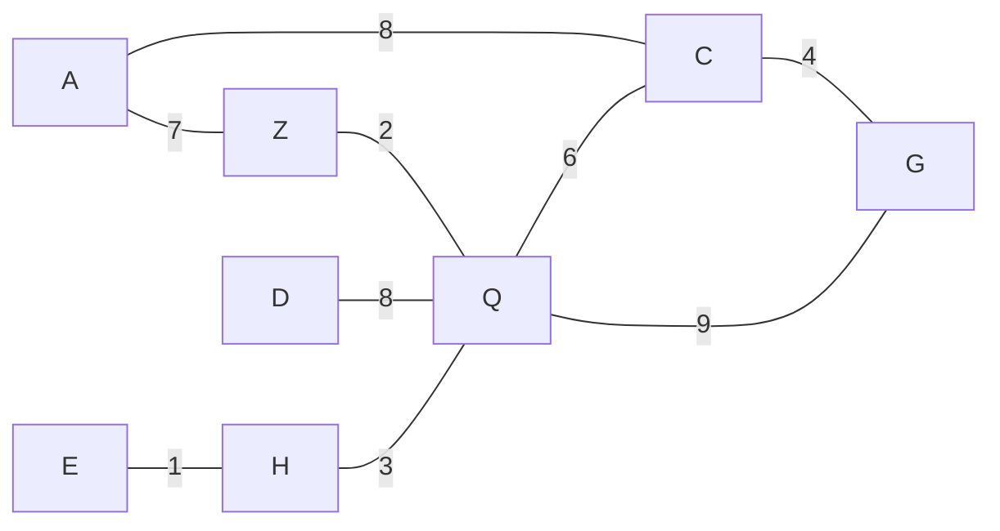

# Dijkstra's Algorithm

**Dijkstra's Algorithm** is an algorithm for finding the shortest paths between nodes in a graph, which may represent, for example, road networks. It was conceived by computer scientist Edsger W. Dijkstra in 1956 and published three years later.

The algorithm exists in many variants. Dijkstra's original algorithm found the shortest path between two given nodes, but a more common variant fixes a single node as the "source" node and finds shortest paths from the source to all other nodes in the graph, producing a shortest-path tree.


For a given source node in the graph, the algorithm finds the shortest path between that node and every other. It can also be used for finding the shortest paths from a single node to a single destination node by stopping the algorithm once the shortest path to the destination node has been determined. For example, if the nodes of the graph represent cities and edge path costs represent driving distances between pairs of cities connected by a direct road (for simplicity, ignore red lights, stop signs, toll roads and other obstructions), Dijkstra's algorithm can be used to find the shortest route between one city and all other cities. A widely used application of shortest path algorithm is network routing protocols, most notably IS-IS (Intermediate System to Intermediate System) and Open Shortest Path First (OSPF). It is also employed as a subroutine in other algorithms such as Johnson's.

The Dijkstra algorithm uses labels (or weights) that are positive integers or real numbers, which are totally ordered. It can be generalized to use any labels that are partially ordered, provided the subsequent labels (a subsequent label is produced when traversing an edge) are monotonically non-decreasing. This generalization is called the generic Dijkstra shortest-path algorithm.

## Algorithm

Let the node at which we are starting at be called the initial node. Let the distance of node Y be the distance from the initial node to Y. Dijkstra's algorithm will assign some initial distance values and will try to improve them step by step.

1. Mark all nodes unvisited. Create a set of all the unvisited nodes called the unvisited set. A Priority Queue can also be used to store the unvisited nodes.
2. Assign to every node a tentative distance value: set it to zero for our initial node and to infinity for all other nodes. Set the initial node as current.
3. For the current node, consider all of its unvisited neighbours and calculate their tentative distances through the current node. Compare the newly calculated tentative distance to the current assigned value and assign the smaller one. For example, if the current node A is marked with a distance of 6, and the edge connecting it with a neighbour B has length 2, then the distance to B through A will be 6 + 2 = 8. If B was previously marked with a distance greater than 8 then change it to 8. Otherwise, the current value will be kept.
4. If the tentative distance to a given node is smaller than the current assigned value, also enqueue the node with its new calculated distance into the priority queue.
5. If the destination node has been marked visited (when planning a route between two specific nodes) or if the smallest tentative distance among the nodes in the unvisited set is infinity (when planning a complete traversal; occurs when there is no connection between the initial node and remaining unvisited nodes), then stop. The algorithm has finished.
6. Otherwise, dequeue the unvisited node that is marked with the smallest tentative distance from the priority queue, set it as the new "current node", and go back to step 3.

**Example:**



- `const g3 = new WeightedGraph();`
- ```js
  g3.addVertex("A")
    .addVertex("Z")
    .addVertex("C")
    .addVertex("D")
    .addVertex("E")
    .addVertex("H")
    .addVertex("Q")
    .addVertex("G");
  ```
- ```js
  g3.addEdge("A", "Z", 7)
    .addEdge("A", "C", 8)
    .addEdge("Z", "Q", 2)
    .addEdge("C", "G", 4)
    .addEdge("D", "Q", 8)
    .addEdge("E", "H", 1)
    .addEdge("H", "Q", 3)
    .addEdge("Q", "C", 6)
    .addEdge("G", "Q", 9);
  ```
- `g3.dijkstra("A", "E") // should return ["A", "Z", "Q", "H", "E"]`
- `g3.dijkstra("A", "Q") // should return ["A", "Z", "Q"]`
- `g3.dijkstra("A", "G") // should return ["A", "C", "G"]`
- `g3.dijkstra("A", "D") // should return ["A", "Z", "Q", "D"]`

```js
dijkstra(startVertex, endVertex) {
  //  Create an object to store the shortest
  //  distances from the start vertex
  const distances = {};

  //  Create another object to keep track of the
  //  previous vertices within the shortest path
  const previousVertices = {};

  for (let vertex in this.adjacencyList) {
    //  Set each key in the distances object to be
    //  every vertex in the adjacency list,
    //  and set each value to be Infinity except for
    //  the start vertex which should have a value of 0
    distances[vertex] = vertex === startVertex ? 0 : Infinity;

    //  Set each key to be every vertex in the adjacency list,
    //  and set each value to be null
    //! Looks like we can skip this because we're
    //! initializing falsy values either way
    // previousVertices[vertex] = null;
  }

  //  Create a priority queue to help traverse the graph
  const pq = new PriorityQueue();

  //  Enqueue starting vertex with priority of 0
  pq.enqueue(startVertex, 0);

  //  Loop through the priority queue
  while (pq.values.length) {
    //  Dequeue the next vertex from the queue
    const currentVertex = pq.dequeue().value;
    //  If vertex is the same as end vertex, exit the loop
    if (currentVertex === endVertex) {
      break;
    }

    //  Otherwise:
    //  Loop through the neighbors of that vertex
    for (let neighbor of this.adjacencyList[currentVertex]) {
      //  Calculate the distance to the neighbor
      //  from the starting vertex
      const distance = distances[currentVertex] + neighbor.weight;
      //  If the distance is less than what is
      //  currently stored in the distances object:
      if (distances[neighbor.vertex] > distance) {
        //  Update the distances object with the lower distance
        distances[neighbor.vertex] = distance;
        //  Update the path to the neighbor stored
        //  within the previous vertices object
        previousVertices[neighbor.vertex] = currentVertex;
        //  Enqueue the vertex with the total distance
        //  from the start node
        pq.enqueue(neighbor.vertex, distance);
      }
    }
  }

  //  Create an array to store results
  const res = [];
  //  Initialize a variable to traverse the graph,
  //  starting from end vertex
  let v = endVertex;
  //  Traverse the graph using the previous vertices object
  while (v) {
    //  Add current vertex to results array
    res.push(v);
    //  Get previous vertex, if any
    v = previousVertices[v];
  }
  //  Return the results array
  //? Make sure to reverse since we traversed from end
  return res.reverse();
}
```

---

## References

[Wikipedia - Dijkstra's algorithm](https://en.wikipedia.org/wiki/Dijkstra%27s_algorithm)
