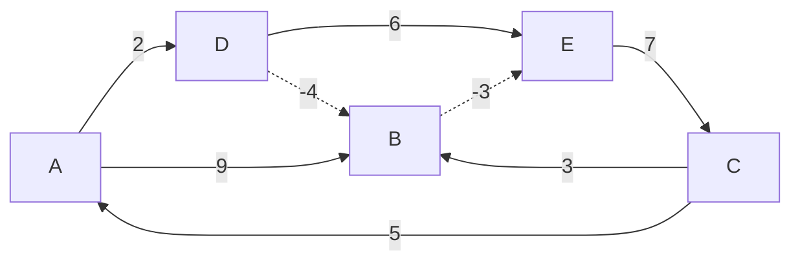
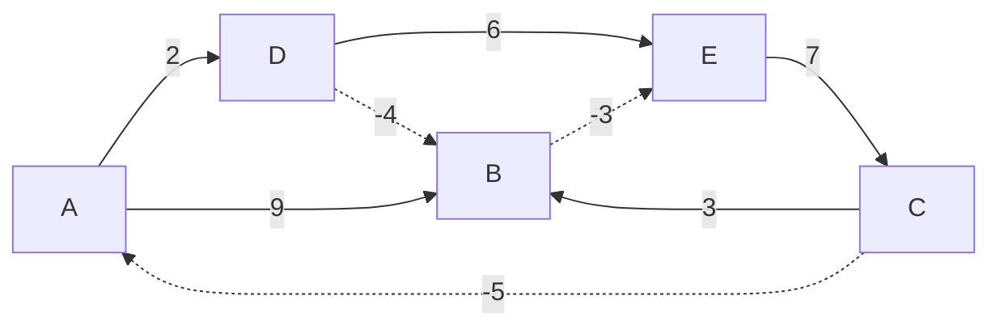

# Bellman–Ford algorithm

The **Bellman–Ford algorithm** is an algorithm that computes shortest paths from a single source vertex to all of the other vertices in a weighted directed graph. It is slower than Dijkstra's algorithm for the same problem, but more versatile, as it is capable of handling graphs in which some of the edge weights are negative numbers.

Negative edge weights are found in various applications of graphs, hence the usefulness of this algorithm. If a graph contains a "negative cycle" (i.e. a cycle whose edges sum to a negative value) that is reachable from the source, then there is no cheapest path: any path that has a point on the negative cycle can be made cheaper by one more walk around the negative cycle. In such a case, the Bellman–Ford algorithm can detect and report the negative cycle.

## Algorithm


Like Dijkstra's algorithm, Bellman–Ford approximates the distances to each vertex and iterates to replace these approximations with better ones until they eventually reach the solution. However, Dijkstra's algorithm uses a priority queue to greedily select the closest vertex that has not yet been processed, and performs this approximation process on all of its outgoing edges; by contrast, the Bellman–Ford algorithm simply performs approximations from all the edges, and does this `V - 1` times, where `V` is the number of vertices in the graph. In each of these repetitions, the number of vertices with correctly calculated distances grows, from which it follows that eventually all vertices will have their correct distances. This method allows the Bellman–Ford algorithm to be applied to a wider class of inputs than Dijkstra. The intermediate answers depend on the order of edges processed, but the final answer remains the same.

Bellman–Ford runs in **O(V \* E)** time, where `V` and `E` are the number of vertices and edges respectively.

## Examples

- **No negative cycle:**



  - `const g4 = new WeightedGraph();`
  - ```js
    g4.addVertex("A")
      .addVertex("B")
      .addVertex("C")
      .addVertex("D")
      .addVertex("E");
    ```

  - ```js
    g4.addDirectedEdge("A", "B", 9)
      .addDirectedEdge("A", "D", 2)
      .addDirectedEdge("B", "E", -3)
      .addDirectedEdge("C", "A", 5)
      .addDirectedEdge("C", "B", 3)
      .addDirectedEdge("D", "B", -4)
      .addDirectedEdge("D", "E", 6)
      .addDirectedEdge("E", "C", 7);
    ```

  - `g4.bellmanFord("A", "C") // should return ["A", "D", "B", "E", "C"]`

- **With negative cycle:**



  - `const g5 = new WeightedGraph();`
  - ```js
    g5.addVertex("A")
      .addVertex("B")
      .addVertex("C")
      .addVertex("D")
      .addVertex("E");
    ```

  - ```js
    g5.addDirectedEdge("A", "B", 9)
      .addDirectedEdge("A", "D", 2)
      .addDirectedEdge("B", "E", -3)
      .addDirectedEdge("C", "A", -5)
      .addDirectedEdge("C", "B", 3)
      .addDirectedEdge("D", "B", -4)
      .addDirectedEdge("D", "E", 6)
      .addDirectedEdge("E", "C", 7);
    ```

  - `g5.bellmanFord("A", "C") // Error: Negative cycle exists!`

```js
bellmanFord(startVertex, endVertex) {
  //  Create an object to store the shortest
  //  distances from the start vertex
  const distances = {};

  //  Create another object to keep track of the
  //  previous vertices within the shortest path
  const previousVertices = {};

  for (let vertex in this.adjacencyList) {
    //  Set each key in the distances object to be
    //  every vertex in the adjacency list,
    //  and set each value to be Infinity except for
    //  the start vertex which should have a value of 0
    distances[vertex] = vertex === startVertex ? 0 : Infinity;
  }

  //  Iterate over the graph V - 1 times
  //? Where V = the number of vertices
  for (let i = 0; i < Object.keys(this.adjacencyList).length - 1; i++) {
    //  Iterate over every edge
    for (let currentVertex in this.adjacencyList) {
      for (let neighbor of this.adjacencyList[currentVertex]) {
        //  Calculate the distance to the neighbor
        //  from the starting vertex
        const distance = distances[currentVertex] + neighbor.weight;
        //  If the distance is less than what is
        //  currently stored in the distances object:
        if (distances[neighbor.vertex] > distance) {
          //  Update the shortest distance
          distances[neighbor.vertex] = distance;
          //  Update the path to the neighbor stored
          //  within the previous vertices object
          previousVertices[neighbor.vertex] = currentVertex;
        }
      }
    }
  }

  //  Iterate over every edge one more time
  for (let currentVertex in this.adjacencyList) {
    for (let neighbor of this.adjacencyList[currentVertex]) {
      //  Calculate the distance to the neighbor
      //  from the starting vertex
      const distance = distances[currentVertex] + neighbor.weight;
      //  If the distance is less than what is
      //  currently stored in the distances object:
      if (distances[neighbor.vertex] > distance) {
        //  Indicate that a negative cycle exists
        throw new Error("Negative cycle exists!");
      }
    }
  }

  //  Create an array to store results
  const res = [];
  //  Initialize a variable to traverse the graph,
  //  starting from end vertex
  let v = endVertex;
  //  Traverse the graph using the previous vertices object
  while (v) {
    //  Add current vertex to results array
    res.push(v);
    //  Get previous vertex, if any
    v = previousVertices[v];
  }
  //  Return the results array
  //? Make sure to reverse since we traversed from end
  return res.reverse();
}
```

## References

[Wikipedia - Bellman-Ford algorithm](https://en.wikipedia.org/wiki/Bellman%E2%80%93Ford_algorithm)
